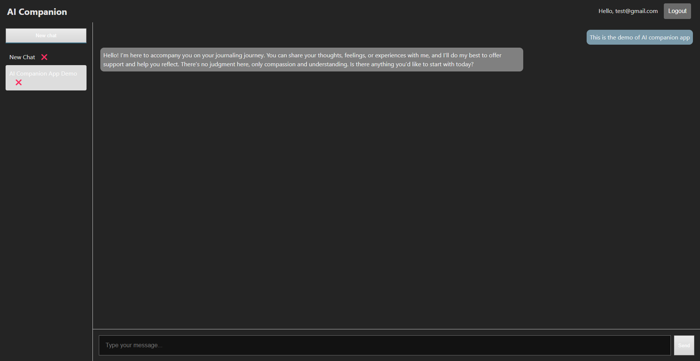

# What is AI Companion App

An AI-Powered chat application designed to provide compassionate emotional support. Built with React, Express, PostgreSQL, and OpenAI API. This full stack application allow user to create account and maintain multiple conversation with AI assistant.

Live demo can be accessed here: https://ai-companion-chat-swart.vercel.app

# Feature list

- GPT-4 integration with prompt engineering techniques
- User authentication using Passport.js and brcrypt)
- Support multiple chat session per user
- Dynamic title generated from user input
- Delete chat by user selection

## Screenshot



## Tech Stack

- **Frontend:** React, Manual CSS
- **Backend:** Node.js, Express
- **Database:** PostgreSQL
- **Auth:** Passport.js, bcrypt
- **API:** OpenAI GPT-4

## Quick Start

### 1. Clone the repo

```bash
git clone https://github.com/HuyGHuynh/ai-companion-chat.git
cd gpt-companion
```

### 2. Install dependencies

```bash
cd client
npm install
cd ../server
npm install
```

### 3. Setup Environment Variables

Create a `.env` file in /server folder with:

```bash
DB_USER=your_db_user
DB_PASS=your_db_password
DB_NAME=companion
DB_HOST=localhost
DB_PORT=5432
PORT=5000
SESSION_SECRET=your_session_secret

```

### 4. Setup the Database

Make sure PostgreSQL is installed and running.

1. Create a database:

```bash
createdb companion
```

2. Run the SQL schema to set up tables:

```bash
cd server
psql -d companion -f schema.sql
```

### 5. Start the development servers

Create a .env file in /server folder with:

```bash
# Backend
nodemon server.js

# Frontend (in /client)
cd ../client
npm run dev
```

The frontend will run on: http://localhost:5173

## Future scope

- Journaling companion mode
- CI/CD deployment (AWS, Vercel, etc.)
